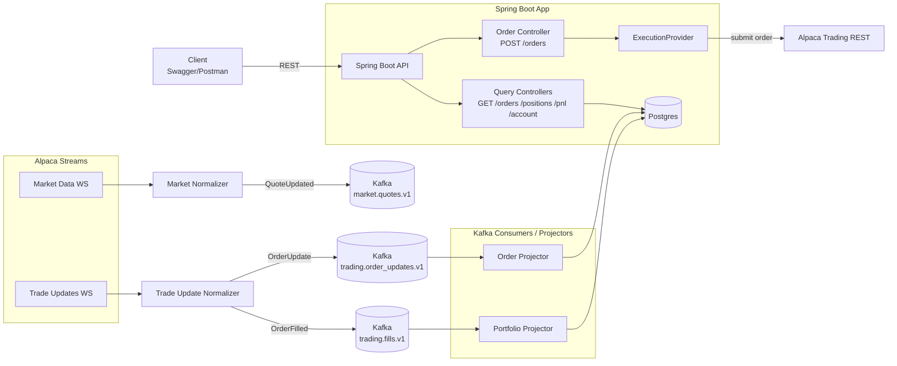
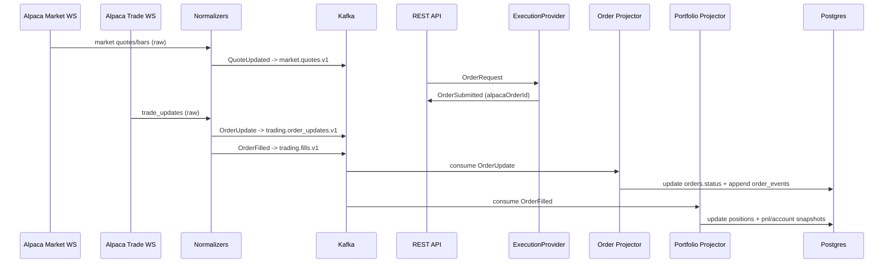
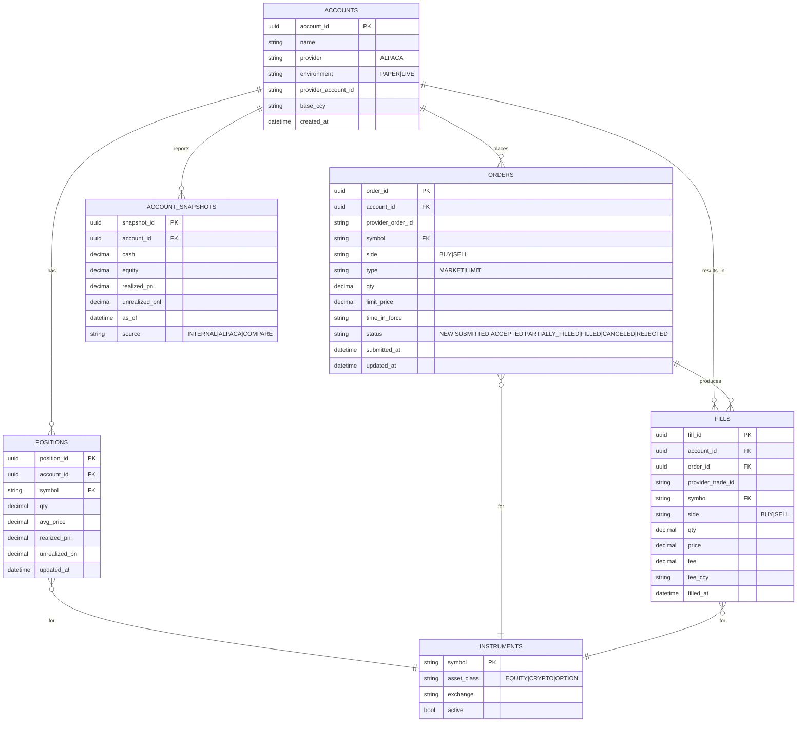

# Trading Platform

An **event-driven trading backend** built with **Spring Boot**, **Apache Kafka**, and **PostgreSQL**, integrating with **Alpaca** for market data and execution.

---

## Project Goals

- Ingest **live market data** from a broker
- Execute **trades** via broker APIs
- Own **orders, fills, positions, and PnL**.
- Be extensible for:
    - algorithmic trading
    - live trading
    - additional providers

---

##  Tech Stack

- Java 17
- Spring Boot 3.5.9
- Apache Kafka
- PostgreSQL
- Flyway
- Alpaca Java SDK.
---

##  High-Level Architecture

---
##  Event Lifecycle

## Data Model

---
